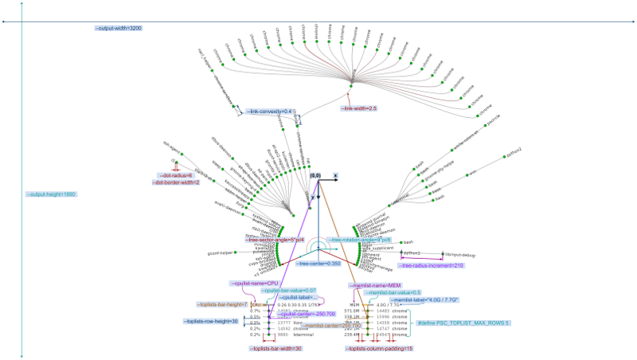
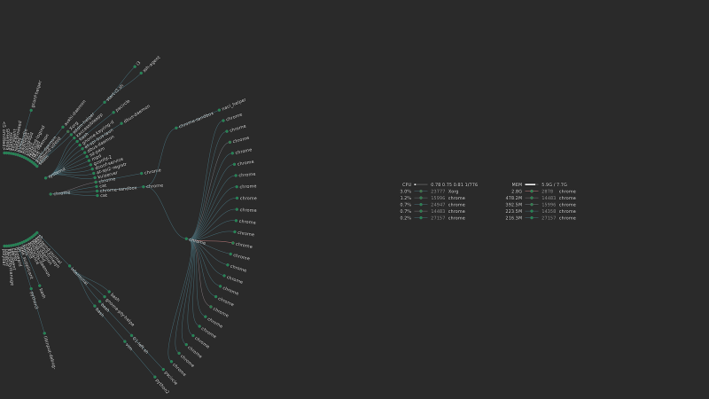
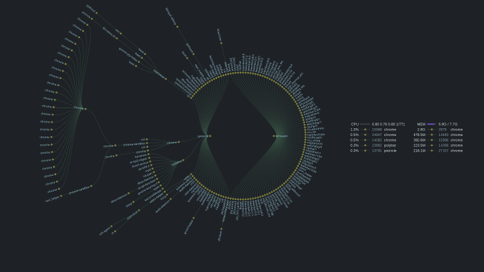
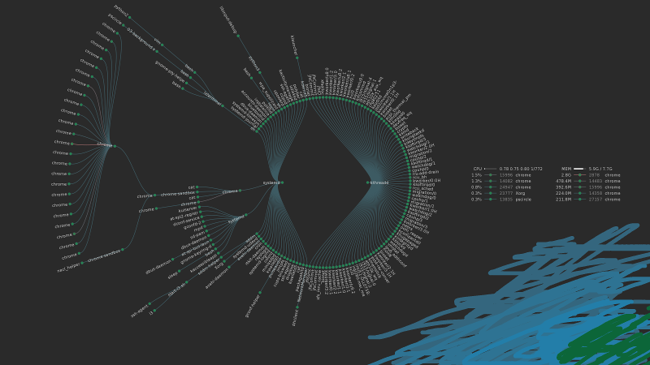
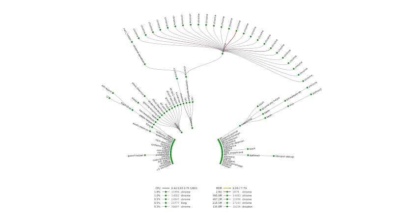

# pscircle

**pscircle** visualizes Linux processes in a form of radial tree.

*by Ruslan Kuchumov, 2018*

# Installation

Make sure you have [meson](http://mesonbuild.com/Getting-meson.html) and [ninja](https://ninja-build.org/) build systems installed.

You will also need the following dependencies:

*  libcairo
*  libpng
*  libx11 (optional; if disabled output to only PNG file will be supported)

In Debian-based distributions you can install them from the repository:

```bash
# Ninja and Meson build systems
sudo apt-get install -y ninja-build python3-pip
pip3 install meson

# Dependencies
sudo apt-get install -y libpng-dev libcairo2-dev libx11-dev
```

To compile and install *pscircle* call:

```bash
mkdir build && cd build
meson ..
ninja
sudo ninja install
```

In case you want to compile without X11 support, call `meson configure -Denable-x11=false` before compiling.

After installation and configuration you may want to create systemd service to regularly update desktop wallpaper:

```bash
cp examples/pscircle.service ~/.config/systemd/user/
systemctl --user enable pscircle
systemctl --user start pscircle
```

## Usage

To view complete list of command line arguments run:

```bash
pscircle --help
```

* When you finish configuring command line arguments you can modify corresponding constants in [config.h.meson](config.h.meson) and recompile the application so that your configuration would be used by default.
* By default image will be pinted directly to X11 root window of the display specified in `--output-display=...`. But you can print image to PNG file by specifying `--output=pscircle.png` argument. (Check [#6 example](examples/06-output-to-image.sh))
* *pscircle* uses `/proc.` Linux pseudo file system for collecting information about processes, uptime, CPU and memory utilization. In case *pscircle* doesn't work correctly with your kernel version, or you want to monitor remote host you can provide this information yourself. (Check [#7 example](examples/07-no-proc-fs.sh.sh))
* *pscircle* calculates processes pcpu values and CPU utilization value over the time interval specified in `--interval` argument. This implies that *pscircle* execution is suspended for this time interval to collect the data. If you want these values to be calculated from the process and system start time (similar to `top` or `htop` utils), you can specify `--interval=0` argument.      
* Parameters related to visualization are described in the following diagram ([full size](docs/parameters.png)):




# Examples

## [Tree at the left](examples/01-left.sh)



[full size](docs/parameters.png)

## [Different fonts and colors](examples/02-colors.sh)



[full size](docs/02-colors.png)

## [Background image](examples/04-background.sh)



[full size](docs/03-background.png)

## [Tree at the bottom](examples/04-bottom.sh)



[full size](docs/04-bottom.png)

For more examples check [/examples](examples/).


# Perfomance

When compiled with `#define PSC_PRINT_TIME 1` cpu time and wall time for different stages will be printed:

Execution times for printing the image to X11 root window:

```
                  cpu /   wall 
         init: 0.0292 / 1.0296 seconds
      arrange: 0.0003 / 0.0003 seconds
    draw tree: 0.0844 / 0.1443 seconds
   draw lists: 0.0009 / 0.0031 seconds
        write: 0.0000 / 0.0000 seconds
        total: 0.1149 / 1.1772 seconds
```

Execution times for printing the image to PNG file:

```
                  cpu /   wall 
         init: 0.0199 / 1.0200 seconds
      arrange: 0.0001 / 0.0001 seconds
    draw tree: 0.1062 / 0.1062 seconds
   draw lists: 0.0009 / 0.0009 seconds
        write: 0.3211 / 0.3211 seconds
        total: 0.4481 / 1.4483 seconds
```

As you can see, drawing the tree to the file (on SSD disk) take almost 4 times longer that printing to X11 screen (0.11 vs 0.45 seconds of cputime). 


# Asknowlegemnts

Thanks Bill MIll for writing an article on [tree visualization algorithm](https://llimllib.github.io/pymag-trees/) which was used in this program.
